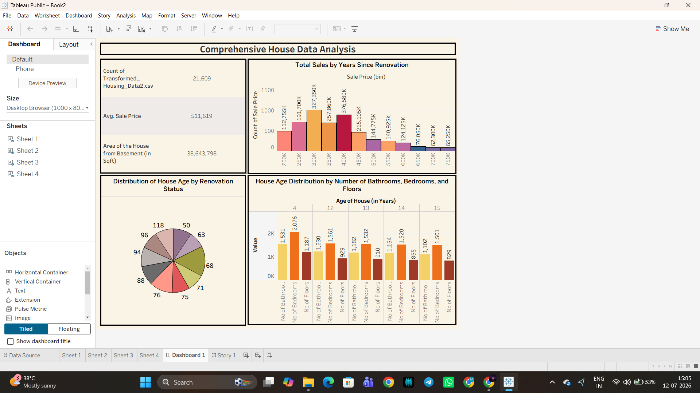
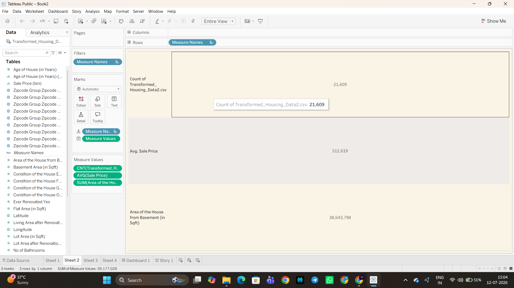
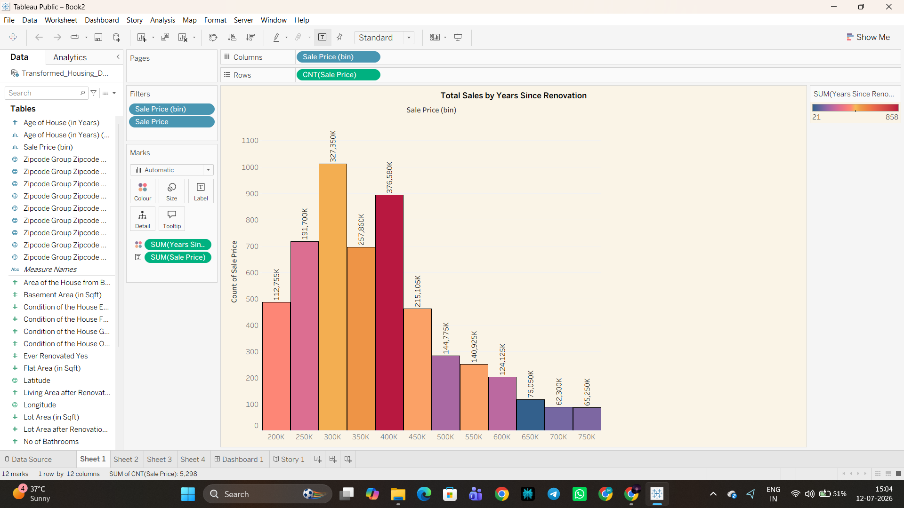
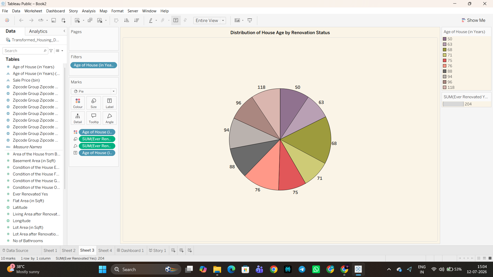
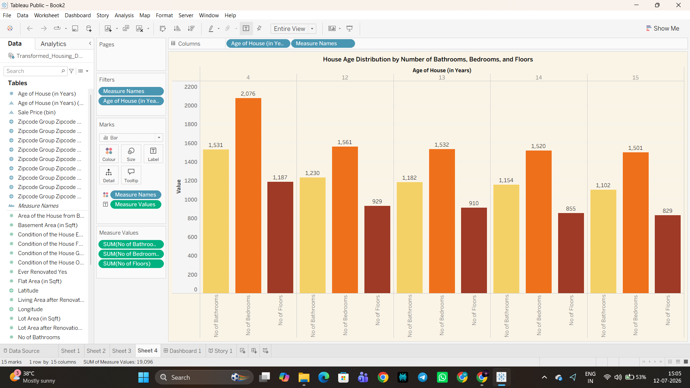
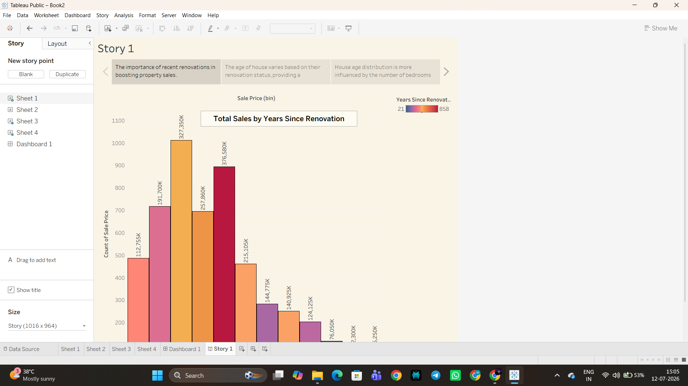
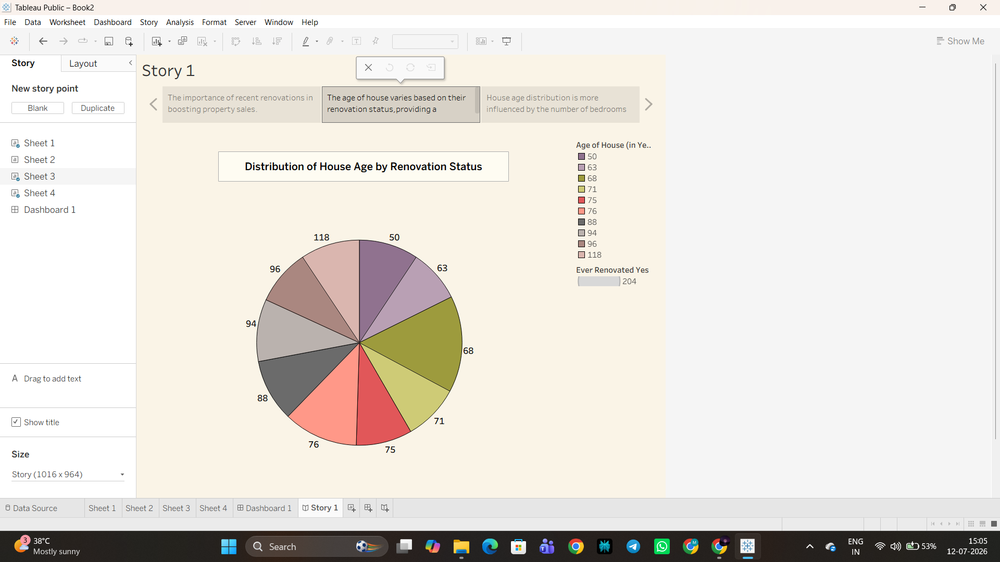
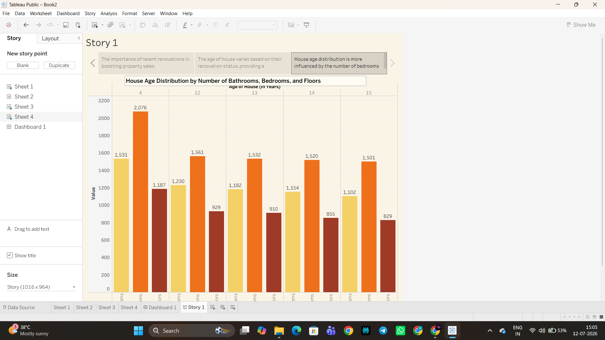

# Visualizing Housing Market Trends: An Analysis of Sale Prices and Features using Tableau

## Project Overview

This project analyzes approximately 21,600 residential sale records using Tableau Public.

It focuses on uncovering the key factors that drive housing prices and sales trends by analyzing a comprehensive dataset of home sales — examining how sale price relates to features such as bedrooms, bathrooms, living area, overall grade, renovation status, house age, waterfront view and location (zipcode group).

The completed solution — the **"Comprehensive House Data Analysis"** dashboard — is published directly to Tableau Public, requiring no custom website or server infrastructure. It gives home buyers, real estate agents and housing market analysts a single, openly accessible interface to explore price-driving patterns through interactive filters and a narrated Tableau Story.

### Dashboard KPIs

- Total Properties (Count of Records)
- Average Sale Price
- Area of the House from Basement (in Sqft)

### Visualizations

- Total Sales by Years Since Renovation

  

- KPI Summary Panel

  

- Distribution of House Age by Renovation Status

  

- House Age Distribution by Bathrooms, Bedrooms and Floors

  

- Tableau Story — Story Point 1: The importance of recent renovations in boosting property sales

  

- Tableau Story — Story Point 2: How house age varies based on renovation status

  

- Tableau Story — Story Point 3: How house age distribution is influenced by the number of bedrooms

  

## Tools Used

- Tableau Public
- Python (pandas) — data cleaning and feature engineering

## Dataset

**Transformed_Housing_Data2.csv** — approximately 21,609 residential sale records across 31 fields, including Sale Price, Bedrooms, Bathrooms, Flat Area, Lot Area, Floors, Overall Grade, Basement Area, Age of House, Years Since Renovation, Condition of the House, Ever Renovated, Waterfront View and Zipcode Group.

## Dashboard Preview

## Use Links

- GitHub Repo: [GitHub Repository](#)
- Tableau Public Profile: [View Tableau Public Profile](#)
- Tableau Dashboard: [View Dashboard](#)
- Tableau Story: [View Story](#)
- Demo Video: [View Video](#)

## Author

- Masa Nani (Team Lead)
- Gabbi Nithya Sree
